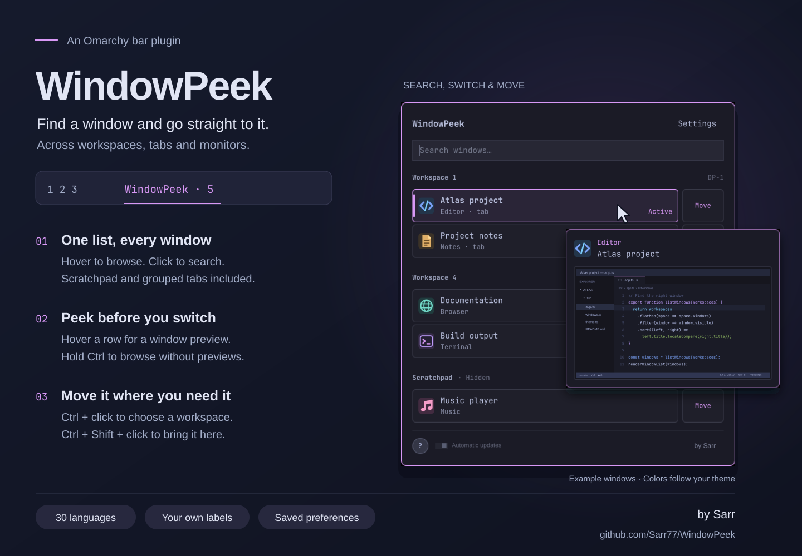

# WindowPeek

Find a window and go straight to it.

WindowPeek puts your open windows in one list on Omarchy’s bar. Search across
workspaces and monitors, peek at a window before switching to it, or move it
somewhere else. You'll never lose a tab in Hyprland window groups again.

[Polski](docs/README.pl.md) · [User guide](docs/GUIDE.md) · [Changelog](CHANGELOG.md)



## Installation

```sh
omarchy plugin add https://github.com/Sarr77/WindowPeek --enable
```

The widget appears on the left of the bar. You can move it in Omarchy’s bar editor.
**Super + Alt + P** opens it on the focused monitor. The shortcut is enabled
automatically unless that key combination is already assigned. If it is, choose
another shortcut in **Settings → Controls → Keyboard & mouse shortcuts**.

Requires Omarchy Quattro with its Quickshell bar and Hyprland’s Lua window API.
Tested on Omarchy 4.0.4, Hyprland 0.56.2, Quickshell 0.3.1 and Qt 6.11.2.
Installation and automatic updates use Python 3 and Git, already included in Omarchy.
The first-use Wallpaper contrast check uses ImageMagick, also included in Omarchy.
See the [development guide](docs/DEVELOPMENT.md) for local development and testing.

## Using it

WindowPeek’s keyboard actions and mouse modifiers can be customized in
**Settings → Controls → Keyboard & mouse shortcuts**, with conflict checks,
individual resets and Apply/Cancel. The shortcuts below are the defaults.

Hover over **WindowPeek** for the window list. Click its name to expand the same
panel and search by application or window title. Scroll to see the rest of the
list. Click the bar label again to close it.

| In either window list | Action |
| --- | --- |
| Click a window or its preview | Switch to that window or tab on its original monitor |
| **Ctrl + click** | Open a small menu to choose its workspace |
| **Ctrl + Shift + click** | Bring it to this monitor’s current workspace and focus it |
| Hold **Shift** | Hide content previews while browsing the list |
| Hold **Ctrl** | Show shortcut numbers beside the visible windows and tabs |
| **Ctrl + 1–9 / 0** | Switch to that numbered window or tab; 0 selects the tenth |
| **Super + Alt + P**, then **1–9 / 0** | Open WindowPeek and choose a visible window without Ctrl for five seconds; numpad works too |
| **Page Up / Page Down** | Scroll the window list by a page |
| **Home / End** | Go to the first or last window; in a nonempty search field, move the text cursor |
| Right-click the main panel | Close WindowPeek and its preview |

Hold **Shift** to browse without showing window previews — useful while streaming
or sharing your screen. Window titles remain visible.

The expanded panel also has **Move** buttons and keyboard navigation. Use ↑ / ↓
to select a window, ← / → to switch between the window and Move, and Enter to
activate it. Hold **Ctrl** to see numbers beside visible windows and tabs, then
press **1–9 / 0** to switch to one. This also works in hover and when Ctrl is held
before opening. The numeric keypad works with Num Lock on or off.
Numbers follow the list as you scroll. **Settings → Window list**
can align them on the right, with **Active** beside them.
**Controls** in Settings lists all gestures and shortcuts.

Find and open a window entirely from the keyboard: press **Super + Alt + P**,
then its visible number. The numbers stay on for five seconds. Start typing to
search immediately, or page through the list and choose a numbered row.
After five seconds, **Ctrl + 1–9 / 0** still works. See the
[keyboard guide](docs/GUIDE.md#keyboard-controls) for the full controls and custom bindings.

Scratchpad and other special workspaces are included by default. Browser tabs
and documents inside an application are not separate windows in this list.
A hidden application that stops drawing may show its last available preview frame.

## Settings

Choose from 30 languages, change colors, adjust panel and bar size, or write
your own labels. Colors, size and text preview as you edit them; **Apply** saves
and **Cancel** restores the previous settings. The **↺** icon restores a default.

**Personalization** offers Solid, Wallpaper and Transparency backgrounds.
Wallpaper is the default, with subtle grain enabled and blur off. It shows the
desktop image behind the panel.
Its transparency is remembered per theme, normally starting at 70%; only severe
contrast problems lower the initial value. Reset returns to that theme’s initial
level. Transparency mode shows the actual windows underneath and starts at 8%.

Click an element in the color editor’s live preview to edit its color, brightness
or field transparency. Save appearance presets for one theme or all themes, with
separate settings for the panel, window rows, menu fields and grain. See
[appearance settings](docs/GUIDE.md#panel-background) for presets and resets.

You can use a click-only panel, disable window previews, choose a compact list,
or turn off springy scrolling. The bar and window previews have separate delays;
set both to **0** and turn off **Popup animations** for instant opening.
Window previews can fit the source window’s proportions, with an optional dark
backing behind the image. Middle-click unused panel space to switch between the
hover list and expanded view.

The **?** button controls hover hints. They start enabled and stop after 100
displays across all monitors. Turn them back on yourself and they stay on until
you switch them off. Settings survive restarts, updates and reinstalls.

## Updates

Automatic updates are on by default. WindowPeek checks about a minute after
startup if it has not checked that day, then every six hours while running.
Restarts preserve the schedule. Only immutable GitHub releases whose exact commit is verified in the
Omarchy catalog can be installed. Failed downloads or checks leave the existing
installation in place.

The small switch beside **?** turns updates off after confirmation. Development
links, forks, copied installations and locally modified code are not updated
automatically. See [update details and limits](docs/UPDATES.md).

## Removal

```sh
omarchy plugin remove sarr.windowpeek
```

Your windows stay where they are. Preferences remain in
`~/.local/state/windowpeek/preferences.json`, or `$XDG_STATE_HOME/windowpeek`
if set. Delete the preferences file after removal if you also want to reset them.
The automatic shortcut is released when the plugin is disabled or removed.
If you added your own binding, remove that binding yourself.

## Data and permissions

WindowPeek reads local window and monitor state, themes and application icons.
It uses `hyprctl` to switch or move windows. Content previews stay in memory
and are released when dismissed; window titles and previews are not saved to disk.
It registers Super + Alt + P while enabled if the combination is free;
existing bindings and Hyprland configuration files are left intact.

Automatic updates contact GitHub and the Omarchy catalog. Check times and
results are stored beside your preferences. There is no telemetry. WindowPeek
runs inside Omarchy’s shell with your user permissions, without administrator access.

## Help and development

[Report a bug](https://github.com/Sarr77/WindowPeek/issues) ·
[Development](docs/DEVELOPMENT.md) · [Tests and limitations](docs/TESTING.md)

MIT · © 2026 [Sarr](https://github.com/Sarr77).
Selected components come from [ScratchPeek](https://github.com/Sarr77/ScratchPeek);
adapted Omarchy controls and the logo retain
[their MIT notice](vendor/omarchy/LICENSE). See [source provenance](docs/SCRATCHPEEK_REFERENCE.md).
