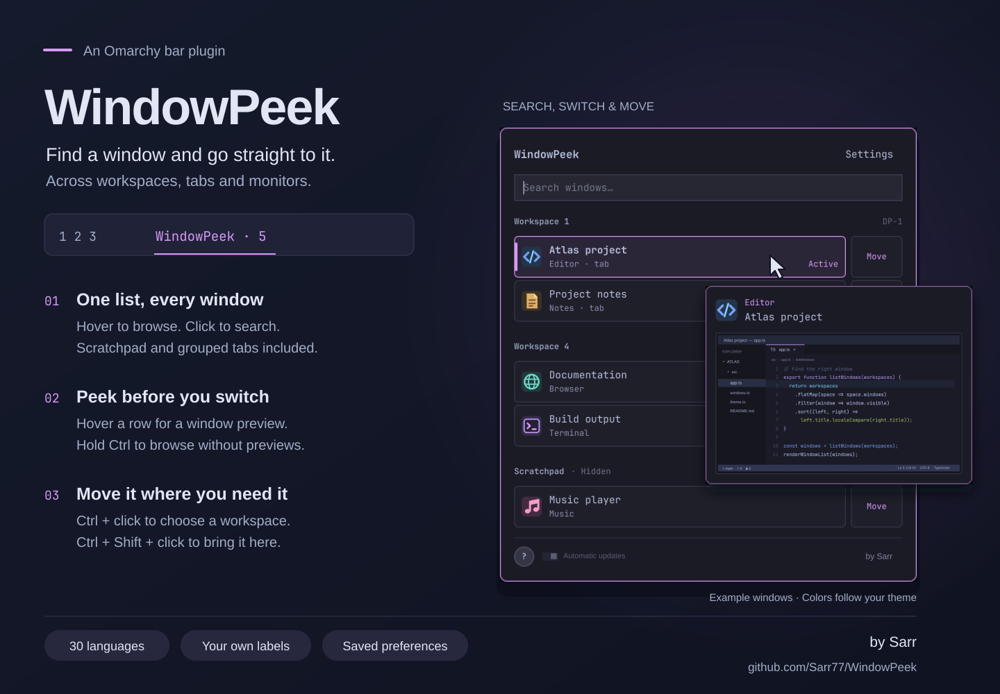

# WindowPeek

Find a window and go straight to it.

WindowPeek puts your open windows in one list on Omarchy’s bar. Search across
workspaces and monitors, peek at a window before switching to it, or move it
somewhere else. You'll never lose a tab in Hyprland window groups again.

[Polski](docs/README.pl.md) · [User guide](docs/GUIDE.md) · [Troubleshooting](docs/TROUBLESHOOTING.md) · [Known issues](docs/KNOWN_ISSUES.md) · [Changelog](CHANGELOG.md)



## Installation

```sh
omarchy plugin add https://github.com/Sarr77/WindowPeek --enable
```

The widget appears on the left of the bar. You can move it in Omarchy’s bar editor.
**Super + Alt + P** opens it on the focused monitor. The shortcut is enabled
automatically unless that key combination is already assigned. If it is, choose
another shortcut in **Settings → Controls → Keyboard & mouse shortcuts**.

Requires Omarchy Quattro with its Quickshell bar and Hyprland’s Lua window API.
Tested on Omarchy 4.0.4, Hyprland 0.56.2, Quickshell 0.3.1 and Qt 6.11.2.
Installation and automatic updates use Python 3 and Git, already included in Omarchy.
The first-use Wallpaper contrast check uses ImageMagick, also included in Omarchy.
See the [development guide](docs/DEVELOPMENT.md) for local development and testing.

## Using it

WindowPeek’s keyboard actions and mouse modifiers can be customized in
**Settings → Controls → Keyboard & mouse shortcuts**, with conflict checks,
individual resets and Apply/Cancel. The shortcuts below are the defaults.

Hover over **WindowPeek** for the window list. Click its name to expand the same
panel and search by application or window title. Typing in the hover list also
expands it and starts searching immediately. The open search keeps keyboard focus
even with the pointer outside the panel, subject to the
[X11 focus limitation](#known-limitations). Scroll to see the rest of the
list. Click the bar label again to close it.

| In either window list | Action |
| --- | --- |
| Click a window or its preview | Switch to that window or tab on its original monitor |
| **Ctrl + click** | Open a small menu to choose its workspace |
| **Ctrl + Shift + click** | Bring it to this monitor’s current workspace and focus it |
| Hold **Shift** | Hide content previews while browsing the list |
| Hold **Ctrl** | Show shortcut numbers beside the visible windows and tabs |
| **Ctrl + 1–9 / 0** | Switch to that numbered window or tab; 0 selects the tenth |
| **Super + Alt + P**, then **1–9 / 0** | Open WindowPeek and choose a visible window without Ctrl for five seconds; numpad works too |
| **Page Up / Page Down** | Scroll the window list by a page |
| **Home / End** | Go to the first or last window; in a nonempty search field, move the text cursor |
| Right-click the main panel | Close WindowPeek and its preview |

Hold **Shift** to browse without showing window previews — useful while streaming
or sharing your screen. Window titles remain visible.

The expanded panel also has **Move** buttons and keyboard navigation. Use ↑ / ↓
to select a window, ← / → to switch between the window and Move, and Enter to
activate it. Hold **Ctrl** to see numbers beside visible windows and tabs, then
press **1–9 / 0** to switch to one. This also works in hover and when Ctrl is held
before opening. The numeric keypad works with Num Lock on or off.
Numbers follow the list as you scroll. **Settings → Window list**
can align them on the right, with **Active** beside them.
**Controls** in Settings lists all gestures and shortcuts.

Find and open a window entirely from the keyboard: press **Super + Alt + P**,
then its visible number. The numbers stay on for five seconds. Start typing to
search immediately, or page through the list and choose a numbered row.
After five seconds, **Ctrl + 1–9 / 0** still works. See the
[keyboard guide](docs/GUIDE.md#keyboard-controls) for the full controls and custom bindings.

Scratchpad and other special workspaces are included by default. Browser tabs
and documents inside an application are not separate windows in this list.
A hidden application that stops drawing may show its last available preview frame.

## Settings

Choose from 30 languages, change colors, adjust panel and bar size, or write
your own labels. Colors, size and text preview as you edit them; **Apply** saves
and **Cancel** restores the previous settings. The **↺** icon restores a default.

**Personalization** offers Solid, Wallpaper and Transparency backgrounds.
Wallpaper is the default, with subtle grain enabled and blur off. It shows the
desktop image behind the panel.
Its transparency is remembered per theme, normally starting at 70%; only severe
contrast problems lower the initial value. Reset returns to that theme’s initial
level. Transparency mode shows the actual windows underneath and starts at 8%.

Click an element in the color editor’s live preview to edit its color, brightness
or field transparency. Save appearance presets for one theme or all themes, with
separate settings for the panel, window rows, menu fields and grain. See
[appearance settings](docs/GUIDE.md#panel-background) for presets and resets.

You can use a click-only panel, disable window previews, choose a compact list,
or turn off springy scrolling. **Settings → Window list** also controls mouse-wheel
speed (50–300% in 1% steps, default 102%). The bar and window previews have separate delays;
set both to **0** and turn off **Popup animations** for instant opening.
Window previews can fit the source window’s proportions, with an optional dark
backing behind the image. Middle-click unused panel space to switch between the
hover list and expanded view.

**Follow bar style**, beside the Wallpaper default label, optionally switches to
Solid with an opaque bar and restores Wallpaper with a transparent bar.

The compact panel's Omarchy logo keeps its height close to the expanded view.
In **Personalization → Pictures and Gifs**, choose each logo separately: Omarchy, 37 screensaver animations, a theme-colored
pixel animation, or your own image (PNG, JPG, WebP, SVG; GIF for animation).
**Random GIF** is the default in Settings: a new Omarchy animation on each
opening, kept while resizing or returning from submenus. Hover keeps the original
pixel wordmark. Both default to theme colors; effects stay as configured.
Choose original or theme colors, transparency, motion and an opening effect.
GIFs start at 50% transparency. In Settings, hold **Ctrl** to drag the artwork,
resize with its handles or mouse wheel, and double-click to center it. Corner
handles preserve proportions. The reset arrow restores the whole artwork preset.
Each animated logo has a **Loop animation** switch and a **Delay loop** field
for the pause between repeats, in seconds (including fractions such as `0.3`).
The default is 4.2 seconds, matching the original pixel animation. With looping
off, playback runs once per appearance; a GIF holds its last frame until then.
**Cooldown**, in seconds or minutes, can prevent another animation when reopening
too soon (hover: one minute; Settings: zero). Enable **Shared cooldown** to make either animation pause
both logos between appearances. Both numbers have their own reset arrow. Either logo can be disabled.
Instructions appear over unused panel space;
the logo has its own tooltip.

Enable **Expand on double-click** in **Panel and previews** to open the compact
panel by clicking **WindowPeek on the bar**. Double-click the bar label or empty
panel space to expand or collapse it.
With **Allow pinning compact panel** on, click outside or press Esc to close.
With it off, the compact panel closes when the pointer leaves, including after collapse.
Home, End, Page Up/Down, arrows and Enter work in the compact view too; Tab expands
it for access to all controls.

The **?** button controls hover hints. They start enabled and stop after 100
displays across all monitors. They show the remaining count and explain how to
disable them with **?** in the expanded panel. In both compact and expanded views,
each hovered element shows its own hint below the panel, one at a time. Empty
space explains only how to expand or collapse the panel. Settings control hints
stay beside the cursor.
Turn them back on yourself and they stay on until
you switch them off. Settings survive restarts, updates and reinstalls.

## Updates

Open **Settings → Controls → Updates** to check for newer code, review changes
and choose **Update…**. Omarchy shows the changes in a terminal and asks before
installing, including updates that have not yet been verified by the catalog.
Development copies are protected and managed with Git.

The small **Auto updates** switch beside **?** checks for new versions
and shows a notice in the expanded panel. Its label toggles the same setting;
turning it off offers **Open Updates** or **Turn off**, while enabling is immediate.
The version and author on the right open a small project menu with links to
Omarchy Plugins, GitHub stars, and bugs or ideas.

**Automatic updates**, on the Updates page, installs only stable immutable
releases whose exact commit is verified by Omarchy. Verification may take time;
newer repository code remains available with your confirmation. Both options
are on by default and can be changed independently. Existing choices are kept.
See [update details and limits](docs/UPDATES.md).

## Removal

```sh
omarchy plugin remove sarr.windowpeek
```

Your windows stay where they are. Preferences remain in
`~/.local/state/windowpeek/preferences.json`, or `$XDG_STATE_HOME/windowpeek`
if set. Delete the preferences file after removal if you also want to reset them.
The automatic shortcut is released when the plugin is disabled or removed.
If you added your own binding, remove that binding yourself.

## Data and permissions

WindowPeek reads local window and monitor state, themes and application icons.
It uses `hyprctl` to switch or move windows. Content previews stay in memory
and are released when dismissed; window titles and previews are not saved to disk.
It registers Super + Alt + P while enabled if the combination is free;
existing bindings and Hyprland configuration files are left intact.

Update checks contact GitHub and the Omarchy catalog. Check times and
results are stored beside your preferences. There is no telemetry. WindowPeek
runs inside Omarchy’s shell with your user permissions, without administrator access.

## Known limitations

Some tiled X11 applications repeatedly request a different window size. On affected
Hyprland versions, this can redirect typing from Search to the window under the
pointer. Giving the requesting window more room or making it floating may help.
**Review options** offers optional typing protection and explains its scrolling
trade-offs. See [Troubleshooting](docs/TROUBLESHOOTING.md).

Version 0.7.2 fixes the reproduced low-refresh-rate resizing stutter, including
with live previews and typing protection. A distinct animation update on every
240 Hz refresh is not guaranteed. See [Known Issues](docs/KNOWN_ISSUES.md) for
verified conditions and remaining limitations.

## Help and development

[Report a bug](https://github.com/Sarr77/WindowPeek/issues) ·
[Development](docs/DEVELOPMENT.md) · [Tests and limitations](docs/TESTING.md)

MIT · © 2026 [Sarr](https://github.com/Sarr77).
Selected components come from [ScratchPeek](https://github.com/Sarr77/ScratchPeek);
adapted Omarchy controls and the logo retain
[their MIT notice](vendor/omarchy/LICENSE). See [source provenance](docs/SCRATCHPEEK_REFERENCE.md).
