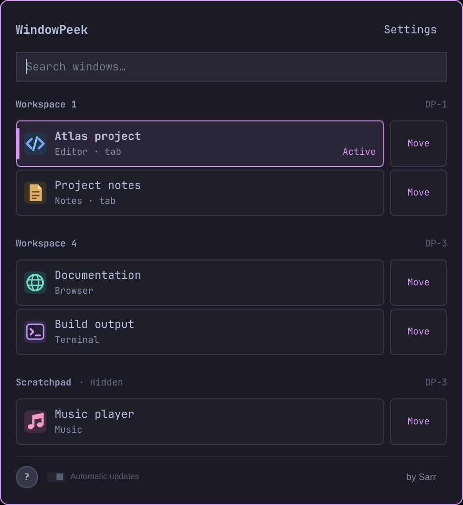

# User guide

## Opening the list

Hover over **WindowPeek** on the bar to see all open windows, grouped by
workspace. The active window appears first. Workspace headings show their
monitor; **Hidden** means the workspace is not currently shown on any monitor.
Scroll with the wheel or drag the scrollbar.

Click the bar label to expand the same panel, adding search, Move and Settings.
The list keeps its position. The expanded footer shows the installed version
next to **by Sarr**. Clicking unused space inside the list also expands
it; another click on unused space returns to the hover view and clears search.
The middle mouse button also toggles between these views when used on empty
space or a workspace heading. Buttons, window rows and the scrollbar keep their
own left-click actions.



Click the bar label again to close the panel. It will not reopen on hover until
you leave the label and return. Right-clicking the main panel closes it too.
In menus, right-click or Escape goes back one step; inside a dropdown it closes
just that dropdown.

Turn off **Open panel on hover** for a click-only panel. In that mode, clicking
empty space cannot collapse the list.

## Finding and previewing a window

Search matches application names and window titles. It includes each tab in a
Hyprland window group, even inactive tabs. It does not list browser tabs or
documents inside an application separately.

Hover a row to see a content preview. You can move onto the preview and click
it to switch to that window. The gaps between the bar, list and preview keep
them open while you cross. A long preview title wraps to two lines.

Hold **Shift** to hide previews while browsing. A preview under your pointer
stays visible, as does one whose move menu is open. Releasing Shift starts the
usual preview delay. To disable previews permanently, turn off **Window previews**.

Previews stay in memory. A hidden application that stops drawing can show its
last available frame. Previewing a window does not activate it or change workspaces.

## Switching and moving

A plain click switches to the selected window or group tab on its existing
monitor. This also applies to windows in the scratchpad.

**Ctrl + click** a row or preview for a small workspace menu at the pointer.
It follows the selected panel style, including the aligned wallpaper used by
Wallpaper dropdowns.
Search or scroll to a destination, then click it to move the window. **Move to
Scratchpad** stays at the bottom. Any preview already open stays visible while
choosing, whether you open the menu from its row or the preview itself.
Escape, right-click or an outside click cancels the menu.

**Move** opens a larger form showing the window’s current workspace and monitor.
Choose a destination and press **Move now**, or use **Move to Scratchpad** above
the dropdown. These moves leave your current workspace in place.

**Ctrl + Shift + click** brings the window to the active ordinary workspace of
the monitor containing WindowPeek, then focuses it. It can take a window out of
the scratchpad. If the window is already there, it is simply focused.

Only the selected group member moves. Other members stay where they are;
locked groups are left intact. Destinations include existing workspaces and
numbered workspaces 1–10. A failed move shows an error instead of pretending it worked.

## Keyboard controls

| Key | Action |
| --- | --- |
| Super + Alt + P | Open WindowPeek on the focused monitor; show quick-selection numbers for five seconds |
| 1–9 / 0 during quick selection | Switch to the numbered visible window or tab without Ctrl; numpad works with Num Lock on or off |
| Page Up / Page Down in the list | Scroll by a page and select a visible window |
| Home / End in the list | Select the first or last window; in a nonempty search field, move the text cursor |
| ↑ / ↓ in search | Select a result |
| Enter in search | Switch to the selected window |
| Shift + Enter in search | Open its Move form |
| ← / → on a window row | Switch between the window and Move |
| ↑ / ↓ on a row action | Change rows, keeping the same action |
| Hold Ctrl in the window list | Show shortcut numbers beside visible windows and tabs |
| Ctrl + 1–9 / 0 in the window list | Switch to the matching numbered window or tab; 0 means tenth. The numeric keypad works with Num Lock on or off |
| Tab / Shift + Tab | Move through visible controls |
| Enter / Space on a control | Activate it |
| Escape | Close a picker, go back, or close the main list |

Arrows within search text edit the text normally. At the text’s edge, the arrow
toward Move enters that column. Window and Move sides are mirrored in Arabic.
**Controls → Keyboard & mouse shortcuts** lets you change WindowPeek’s actions:
opening the panel, the modifier for visible-window numbers, holding a key to hide
previews, moving a selected window, list navigation and modified mouse clicks.
The table above shows the defaults. Number selection always includes the numeric
keypad; the five-second quick selection after keyboard opening stays available.

Click the key combination beside an action. You can record a new combination
or select its modifiers and key with the mouse. Recording starts only when the
compositor grants shortcut protection; if unavailable, use the buttons instead.
Conflicts with another WindowPeek action or an existing Hyprland binding are
shown before saving. Tab, Shift+Tab, Enter, Space and Esc retain normal control
navigation; plain letters remain available for search.

Each row has a reset button. **Restore default shortcuts** resets the whole draft;
**Apply** saves it for both views and all monitors, and **Cancel** discards it.
Help and hover hints follow the saved bindings. Manually added Hyprland shortcuts
remain active alongside WindowPeek’s managed opening shortcut; the editor does
not rewrite your Hyprland configuration.

**Controls** also covers dropdowns, color editing and mouse gestures.

Number shortcuts count the first ten window rows in the visible part of the
list, including individual group tabs; workspace headings do not count. Numbers
start again at 1 as you scroll and update after searching or filtering. They
appear after the app name or the tab marker while Ctrl is held. Turn on
**Shortcut numbers on the right** in **Settings → Window list** to place them
in a vertical column at the right of the second line; **Active** moves to their left.
The default is after the app or tab label. Selecting one
keeps the window on its existing monitor and closes the panel.
A missing position does nothing.
These shortcuts work in hover and the expanded window list, including when Ctrl
was pressed before opening. Hover takes keyboard focus only while Ctrl is held,
then returns it on release without expanding. Settings and move menus keep their own keys.

**Super + Alt + P** is registered automatically when WindowPeek is enabled,
including after installing from the catalog. Existing bindings take precedence;
WindowPeek never replaces one. Its automatic binding is released when the plugin
is disabled or removed and does not edit Hyprland configuration files.

Opening with this shortcut, or the `open`/`toggle` IPC commands, starts a
five-second quick-selection period. Press a visible **1–9 / 0** without Ctrl,
on either the number row or the numeric keypad. Scrolling updates the numbers.
Typing a search query ends quick selection immediately; after five seconds,
digits also become ordinary search text. **Ctrl + 1–9 / 0** remains available.
Opening by mouse keeps the usual search behavior.

To use a different shortcut, choose **Settings → Controls → Keyboard & mouse
shortcuts → Open WindowPeek**. This also works when the default combination
is already assigned to another action.

For a manually managed binding instead, add the following to
`~/.config/hypr/bindings.lua` (replace the key combination as needed):

```lua
o.bind("SUPER + ALT + P", "WindowPeek", 'omarchy-shell sarr.windowpeek toggle ""')
```

Run `hyprctl reload`, then `hyprctl configerrors` to check the configuration.
An existing manual WindowPeek binding to this command also starts quick selection.

## Settings

Language is at the top. **Automatic** follows your system language; you can
choose any of the 30 translations yourself. Open a category by clicking its
wide header. The header stays in place while its contents expand below it.

- **Panel and previews:** hover mode, content previews, their separate opening
  delays, and popup animations. Both delays start at 400 ms and accept 0–2000 ms.
  Set them to 0 and disable animations for instant popups. Disabled controls
  keep their saved values.
- **Window list:** special workspaces, Spacious or Compact rows, springy
  scrolling, and shortcut-number placement. Compact affects both lists without shrinking the text. Special
  workspaces and springy scrolling start enabled.
- **Personalization:** panel background, colors, panel and bar size, bar label
  and custom text.
- **Controls:** editable action shortcuts and mouse modifiers, plus the keyboard and mouse guide.

Switches, language, delays and list choices save as you change them. A failed
save shows an error and leaves the previous choice in effect.

### Panel background

Choose a background under **Settings → Personalization**:

- **Solid** uses the usual theme-colored surface.
- **Wallpaper**, the default, shows the current wallpaper, aligned with its position on your
  monitor. Applications behind the panel stay hidden. You can add **Blur wallpaper**
  and **Subtle grain** for a glass effect.
- **Transparency** shows what is actually behind the panel, including other
  windows. It starts at just 8% transparency to keep text easy to read.

The **Transparency** slider runs from 0% to 100%. Wallpaper normally starts at
70%. On first use in a theme, WindowPeek checks the wallpaper beneath the panel.
Only widespread, very poor contrast lowers this initial transparency, including
contrast for small descriptions. Acceptable backgrounds keep their existing value.
The check uses the theme's actual text color: a light wallpaper with readable dark
text can stay at 70%. During a theme switch, it waits for the new colors to load.

Wallpaper remembers the slider and its initial level separately for each theme.
The reset arrow restores **that theme’s initial level**. Your later adjustments
take priority; reopening, restarting or changing wallpaper does not repeat the
automatic adjustment for a theme already initialized. Transparency mode keeps
its separate value and 8% reset level. Existing settings are kept as the starting
point for themes without a saved value.
**Subtle grain** starts enabled and is also available with Transparency.
**Blur wallpaper** starts disabled. Both can be changed independently.

These choices apply to the hover list, search panel and window-preview frame.
Text, icons and the preview itself stay fully visible; rows retain a theme-colored
fill. Wallpaper dropdowns show the matching part of the wallpaper with the same
effects and a stronger tint for readable options. Controls underneath do not
show through. If the wallpaper cannot be loaded, its background falls back to
solid. Wallpaper blur works without changing Hyprland settings;
the Transparency mode follows the compositor’s blur setting when supported.
Switching modes keeps your colors, presets and other preferences.

The **Panel and previews** section also contains **Dark backing behind preview
image**. Turn it off to expose the preview frame’s own background instead of the
dark inset; it does not remove dark areas that belong to the captured application.
**Fit preview to window proportions** is on by default. The card follows portrait
and landscape windows within the monitor’s size limit. Once the first captured
frame sets its proportions, the frame stays the same size until closed. If the
source window is resized, its live image fits inside that frame; reopening the
preview fits the new proportions. Turn it off for the previous fixed frame. The app icon and title remain above the image.

### Colors

The color editor expands to fit its contents when the monitor has enough room.
On smaller screens it uses the available height and keeps the controls scrollable.

Choose **Color element** to edit the accent, panel background, window/tab fields,
menu sections, grain or wallpaper. Colors use the palette, hue slider and HEX
field. Panel, row and menu fills have brightness controls; wallpaper has its
own brightness slider. Row and menu transparency are independent of the main
panel slider. Grain has a separate color and strength.

The panel tint works with Solid, Wallpaper and Transparency. For the accent,
**Adapted** uses `#D898F5` in Tokyo Night and the theme accent elsewhere.
**Omarchy accent** always follows the theme. Other elements can follow their
theme color or use a custom one. The editor preview shows the chosen background
mode, window fields and menu fill.

Click a panel background, window row, accent or menu section in **Live preview**
to select its color element. The preview sits at the top of the editor, above
the controls; clicking does not scroll it away. A contrasting outline marks the
selected element, and the heading names it. Both follow the **Color element**
dropdown as well as clicks on the preview.
Selections retain your draft; **Apply** saves it. The sample rows do not switch
windows. Grain remains selectable through **Color element**.

**Only [theme]** keeps a separate choice for that theme. **All themes** uses
that element’s settings everywhere, retaining individual theme choices for later.
Expand **Appearance presets** to save up to 24 named sets of accent and surface
colors, brightness and field transparency. Applying a preset uses the selected
theme scope. Presets retain theme-following colors; existing single-color
presets still work. Background mode, its main transparency slider, blur and grain
switches remain separate settings.

Each slider has a reset arrow. The element’s **↺** resets its color, brightness
and transparency together. **Restore default colors** restores the default colors,
brightness and field transparency for the selected scope, retaining presets and
other themes. It does not reload a saved preset. **Restore saved color**
restores that element’s last applied settings. **Apply** saves the draft;
Cancel, Back or closing the panel discards changes, including preset edits and
resets.

### Interface size

Panel size and bar text scale independently from 80% to 200%. At 100% they
follow Omarchy’s settings. The bar’s height may limit its text size; the editor
shows when this happens. **↺** restores 100%. Apply saves; Cancel or Back undoes
changes, including resets.

### Custom text

Change labels on the bar, panel headings, workspace names, statuses, actions
and hints. Available variables appear beside each field, such as `{count}`
for the bar. Unknown variables prevent Apply.

A blank field uses its translated default. That default stays visible below
the field, and **↺** clears just that override. **Reset all text** clears all
text overrides in the draft. Selecting the Default style keeps your custom
text saved but inactive. Your own text is not translated when changing languages.

Apply saves; Cancel, Back or closing the panel restores the previous text.
Technical settings, errors and the author credit keep their application wording.

## Hints and saved preferences

The **?** button turns hover hints on or off. Automatic hints stop after 100
actual displays, shared across monitors. Turning them back on manually keeps
them on until manually disabled. Hints and content previews are separate.

Preferences are stored outside the plugin in
`~/.local/state/windowpeek/preferences.json`, or `$XDG_STATE_HOME/windowpeek`
if set. They survive restarts, updates and reinstalls. WindowPeek does not
share preferences with ScratchPeek.

For automatic updates, see [update details](UPDATES.md). For installation from
a local source directory, see [development](DEVELOPMENT.md).
