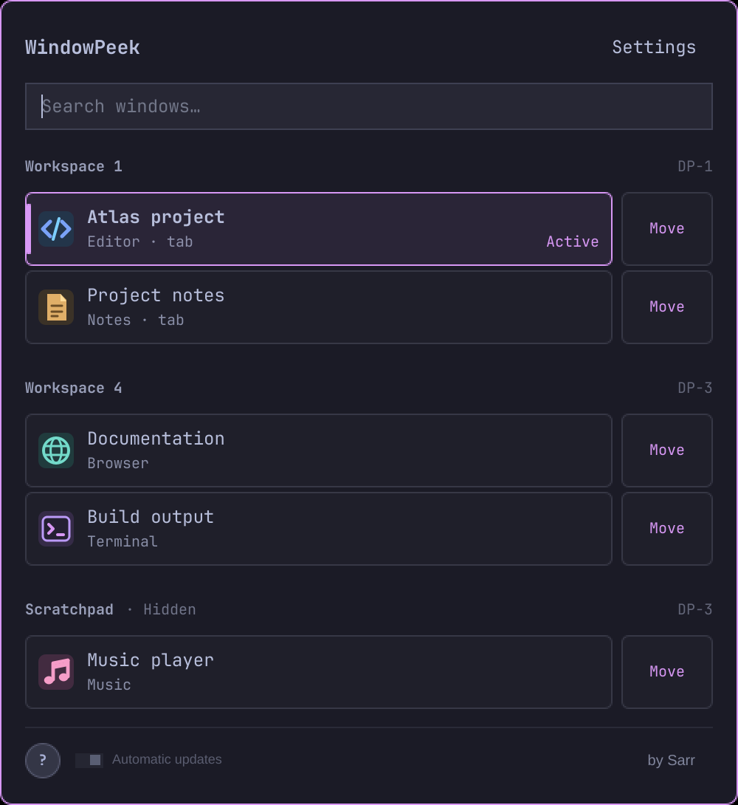

# User guide

For help choosing a solution, see [Troubleshooting](TROUBLESHOOTING.md).
For confirmed problems and reproduction steps, see [Known Issues](KNOWN_ISSUES.md).

## Opening the list

Hover over **WindowPeek** on the bar to see all open windows, grouped by
workspace. The active window appears first. Workspace headings show their
monitor; **Hidden** means the workspace is not currently shown on any monitor.
Scroll with the wheel or drag the scrollbar.

By default, a single click on the bar label opens the compact panel. Double-click
the label to expand or collapse the same panel, adding search, Move and Settings.
The list keeps its position. The expanded footer shows the installed version
next to **by Sarr**. Double-clicking unused space inside the list also expands
it; another double-click there returns to the hover view and clears search.
The middle mouse button also toggles between these views when used on empty
space or a workspace heading. Buttons, window rows and the scrollbar keep their
own left-click actions.

Settings and its subpanels have the **pin icon** beside Back. Pin keeps the panel open
when you click another app, while letting that app receive keyboard input.
The pin stays through submenu navigation and returning to the list. **Unpin**
restores outside-click dismissal; **Close**, to its left, closes the panel directly.
A new opening starts unpinned. This pin is separate from compact bar-click pinning
and typing protection.
While pinned, typing protection pauses its keyboard hold and intentional focus
changes do not trigger warnings. Unpin restores the saved protection behavior.

If an update is available, a button beside Settings opens its details before
you choose whether to install it. It uses the background check's cached result.

Hover the logo for its own help or a window row for that window's actions.
Hover unused panel space for its expand/collapse gesture. These hints stay below
the panel in both modes and take no space in the list. During the automatic
100-display budget, the footer names **?** in the expanded panel to turn hints off.
Collapsing keeps the old pointer area until you reach the resized
card or leave the old area, so the panel does not disappear under a stationary
pointer, even with the logo disabled.



Click the bar label again to close the panel. It will not reopen on hover until
you leave the label and return. Right-clicking the main panel closes it too.
Right-click closes the innermost dropdown or editor first. In Settings it collapses
the most recently opened section, regardless of pointer position. Only a further right-click from the collapsed overview returns
to the window list. Escape also closes the nearest inner level. The Back button
skips inner sections and leaves the current editor. Returning from Troubleshooting
follows the route used to enter it, preserving the previous view.
Scrolling outside the panel goes to the application under the pointer.

Turn off **Open panel on hover** for a click-only panel. **Expand on
double-click** in **Settings → Panel and previews** is on by default: a click on
**WindowPeek in the bar** opens the compact view and a double-click expands
or collapses it. Turn this option off to expand with a single click instead.
Updates preserve an explicitly saved choice. With **Allow pinning compact panel** enabled, the compact view stays
open until you click outside, press Esc or click the bar label again. With it off,
the compact view closes when the pointer leaves, including after collapse. Double-click
unused panel space to switch views; a single click there does not pin or expand
the panel. Middle-click also works. This option works
with hover disabled. Without it, click-only mode always opens the full panel.
Double-click works in both directions directly on the **WindowPeek** bar label,
including when the first click has already opened the compact panel.

## Finding and previewing a window

Search matches application names and window titles. It includes each tab in a
Hyprland window group, even inactive tabs. It does not list browser tabs or
documents inside an application separately.

Hover a row to see a content preview. You can move onto the preview and click
it to switch to that window. The gaps between the bar, list and preview keep
them open while you cross. A long preview title wraps to two lines.

Hold **Shift** to hide previews while browsing. A preview under your pointer
stays visible, as does one whose move menu is open. Releasing Shift starts the
usual preview delay. To disable previews permanently, turn off **Window previews**.

Previews stay in memory. A hidden application that stops drawing can show its
last available frame. Previewing a window does not activate it or change workspaces.

## Switching and moving

A plain click switches to the selected window or group tab on its existing
monitor. This also applies to windows in the scratchpad.

**Ctrl + click** a row or preview for a small workspace menu at the pointer.
It follows the selected panel style, including the aligned wallpaper used by
Wallpaper dropdowns.
Search or scroll to a workspace. Existing workspaces keep their monitor. For a
new workspace, choose a monitor in the next step; **Shift + click** or
**Shift + Enter** uses the screen containing WindowPeek. With one monitor, no
extra choice is needed. **Back**, Escape or right-click returns to workspace
selection; **Cancel** or an outside click cancels. **Move to Scratchpad** stays at the bottom
of the workspace step. Any preview already open stays visible while
choosing, whether you open the menu from its row or the preview itself.

**Move** opens a larger form showing the window’s current workspace and monitor.
Choose a workspace and, when creating one, its monitor. The final selection moves
the window immediately. **Cancel** is available at both steps, including inside
the selection lists. Escape closes a list; **Back** leaves the move view.
Shift while selecting a new workspace chooses WindowPeek’s screen here too.
**Move to Scratchpad** above the dropdown remains a direct action. These moves
leave your current workspace in place and never relocate an existing workspace.

**Ctrl + Shift + click** brings the window to the active ordinary workspace of
the monitor containing WindowPeek, then focuses it. It can take a window out of
the scratchpad. If the window is already there, it is simply focused.

Only the selected group member moves. Other members stay where they are;
locked groups are left intact. Destinations include existing workspaces and
numbered workspaces 1–10. A failed move shows an error instead of pretending it worked.

## Keyboard controls

| Key | Action |
| --- | --- |
| Super + Alt + P | Open WindowPeek on the focused monitor; show quick-selection numbers for five seconds |
| 1–9 / 0 during quick selection | Switch to the numbered visible window or tab without Ctrl; numpad works with Num Lock on or off |
| Page Up / Page Down in the list | Scroll by a page and select a visible window |
| Home / End in the list | Select the first or last window; in a nonempty search field, move the text cursor |
| ↑ / ↓ in hover or search | Select a result |
| Enter in hover or search | Switch to the selected window |
| Shift + Enter in hover or search | Open its Move form |
| ← / → on a window row | Switch between the window and Move |
| ↑ / ↓ on a row action | Change rows, keeping the same action |
| Hold Ctrl in the window list | Show shortcut numbers beside visible windows and tabs |
| Ctrl + 1–9 / 0 in the window list | Switch to the matching numbered window or tab; 0 means tenth. The numeric keypad works with Num Lock on or off |
| Tab / Shift + Tab | Move through visible controls |
| Enter / Space on a control | Activate it |
| Escape | Close a picker, go back, or close the main list |

Home, End, Page Up/Down and ↑/↓ also work directly in the hover list.
Enter or Space selects its highlighted window. Tab, Shift+Tab and the side arrows
expand the panel to expose its controls; Shift+Enter opens the Move form.
Saved shortcuts apply to both views. Start typing in the hover list to expand it
and search immediately, including from a pinned compact panel. Shortcuts take
priority over text input. Without additional typing protection, compact browsing
follows your mouse-focus settings: moving to another window can focus it, and
hovering WindowPeek again lets you type without clicking. Expanded Search keeps
keyboard focus outside the panel, even with an empty query. Collapsing returns to
compact browsing; closing WindowPeek returns the keyboard to the application.
See the [known X11 exception](#x11-applications-interrupting-search) if typing
stops when the pointer moves over another window.

Arrows within search text edit the text normally. At the text’s edge, the arrow
toward Move enters that column. Window and Move sides are mirrored in Arabic.
**Controls → Keyboard & mouse shortcuts** lets you change WindowPeek’s actions:
opening the panel, the modifier for visible-window numbers, holding a key to hide
previews, moving a selected window, list navigation and modified mouse clicks.
The table above shows the defaults. Number selection always includes the numeric
keypad; the five-second quick selection after keyboard opening stays available.

Click the key combination beside an action. You can record a new combination
or select its modifiers and key with the mouse. Recording starts only when the
compositor grants shortcut protection; if unavailable, use the buttons instead.
Conflicts with another WindowPeek action or an existing Hyprland binding are
shown before saving. Tab, Shift+Tab, Enter, Space and Esc retain normal control
navigation; plain letters remain available for search.

Each row has a reset button. **Restore default shortcuts** resets the whole draft;
**Apply** saves it for both views and all monitors, and **Cancel** discards it.
Help and hover hints follow the saved bindings. Manually added Hyprland shortcuts
remain active alongside WindowPeek’s managed opening shortcut; the editor does
not rewrite your Hyprland configuration.

**Controls → Hints and Support** covers dropdowns, color editing and mouse gestures.
It also explains the **?** hints button. **Report Bugs or Post Your Ideas** opens
the project’s GitHub Issues in your default browser. The guide has expandable
sections for the window list, moving windows, keyboard controls and Settings;
its key combinations follow your saved shortcuts.

Number shortcuts count the first ten window rows in the visible part of the
list, including individual group tabs; workspace headings do not count. Numbers
start again at 1 as you scroll and update after searching or filtering. They
appear after the app name or the tab marker while Ctrl is held. Turn on
**Shortcut numbers on the right** in **Settings → Window list** to place them
in a vertical column at the right of the second line; **Active** moves to their left.
The default is after the app or tab label. Selecting one
keeps the window on its existing monitor and closes the panel.
A missing position does nothing.
These shortcuts work in hover and the expanded window list, including when Ctrl
was pressed before opening. Holding or releasing Ctrl does not expand the panel;
typing search text does. Settings and move menus keep their own keys.

**Super + Alt + P** is registered automatically when WindowPeek is enabled,
including after installing from the catalog. Existing bindings take precedence;
WindowPeek never replaces one. Its automatic binding is released when the plugin
is disabled or removed and does not edit Hyprland configuration files.

Opening with this shortcut, or the `open`/`toggle` IPC commands, starts a
five-second quick-selection period. Press a visible **1–9 / 0** without Ctrl,
on either the number row or the numeric keypad. Scrolling updates the numbers.
Typing a search query ends quick selection immediately; after five seconds,
digits also become ordinary search text. **Ctrl + 1–9 / 0** remains available.
Opening by mouse keeps the usual search behavior.

To use a different shortcut, choose **Settings → Controls → Keyboard & mouse
shortcuts → Open WindowPeek**. This also works when the default combination
is already assigned to another action.

For a manually managed binding instead, add the following to
`~/.config/hypr/bindings.lua` (replace the key combination as needed):

```lua
o.bind("SUPER + ALT + P", "WindowPeek", 'omarchy-shell sarr.windowpeek toggle ""')
```

Run `hyprctl reload`, then `hyprctl configerrors` to check the configuration.
An existing manual WindowPeek binding to this command also starts quick selection.

## Settings

The [Settings guide](SETTINGS.md) follows every section and subpage in the interface,
with controls, saving behavior and current defaults.

### Panel background

See [Panel background in Settings](SETTINGS.md#panel-background).

### Colors

See [Colors in Settings](SETTINGS.md#colors).

### Interface size

See [Interface size in Settings](SETTINGS.md#interface-size).

### Text readability

See [Text readability in Settings](SETTINGS.md#text-shadow).

### Custom text

See [Custom text in Settings](SETTINGS.md#custom-text).

### Pictures and GIFs

See [Pictures and GIFs in Settings](SETTINGS.md#pictures-and-gifs).

## Defaults

See [the defaults table](SETTINGS.md#defaults). Updates keep saved choices.

## Hints and saved preferences

The WindowPeek name on the bar has a contextual hint below the open panel.
It describes pinning or closing when enabled, and the current expand/collapse
gesture. **Panel and previews → Allow pinning compact panel** controls whether
the compact view stays open after a bar click or collapse. The panel's own title
has the same expand/collapse gesture as its background, with no separate pin action.

The **?** button turns hover hints on or off, including logo and control hints.
In both compact and expanded views, hints describe the element under the pointer.
Window actions, logos, empty panel space and footer controls share the panel's
bottom area and appear one at a time. Settings control hints appear beside the
pointer. Automatic hints show how many displays remain and where to turn them off
in the expanded panel.
Automatic hints stop after 100 actual displays, shared across monitors. Turning
them back on manually keeps them on until manually disabled, without a countdown
or status footer. The **?** explanation stays available.
Hints and content previews are separate.

Preferences are stored outside the plugin in
`~/.local/state/windowpeek/preferences.json`, or `$XDG_STATE_HOME/windowpeek`
if set. They survive restarts, updates and reinstalls. WindowPeek does not
share preferences with ScratchPeek.

For **Settings → Controls → Updates**, manual terminal confirmation and automatic
updates, see [update details](UPDATES.md). For installation from
a local source directory, see [development](DEVELOPMENT.md).

## Known issues

### X11 applications interrupting search

On Hyprland 0.56.2, some X11 applications repeatedly request a new window size
while tiled. This has been confirmed with RSI Launcher running through Wine.
Hyprland rejects the resize but also moves keyboard focus to the window under
the pointer. As a result, WindowPeek can stop receiving text when the pointer
leaves the panel for another application, or when filtering makes the panel
shrink above a stationary pointer. Keeping a panel visible is not the same as
protecting its keyboard input. The header pin deliberately allows other apps
to receive typing and pauses typing protection.
Moving over empty desktop space did not trigger the same loss in the reproduced
case.

The trigger is the application's **tiled** window, rather than its ordinary
floating mode. Temporarily making that application floating, or closing it
when not needed, avoids the confirmed trigger. This is a workaround, not a
WindowPeek setting; the plugin does not change other applications' tiling.

The same failure occurs in an independent panel without WindowPeek running.
It does not mean every X11 or Wine application is affected. Other Hyprland
versions have not been verified. There is no complete fix preserving all outside input. Optional protection
modes are described below; their scrolling restrictions are explained before
you choose. WindowPeek never repeatedly forces focus back in a loop.

See the [technical explanation](ARCHITECTURE.md#x11-resize-requests-and-keyboard-focus)
and [test coverage](TESTING.md#search-focus-outside-the-compact-and-expanded-panel).


## Interrupted search with an X11 application

If search loses keyboard focus while a tiled X11 window repeatedly requests a
new size, WindowPeek may show **Typing in search was interrupted → Review options**.
Open it to see alternatives and optional **temporary protection**. It will never
enable protection simply because an application is running.

Protection helps keep typing in the panel, but touchpad scrolling and rapid
wheel movements outside it may fail. The dialog explains this before you choose.
You can instead try giving the affected window more room, making it floating, closing it when unused,
or using its documented native Wayland launch mode where supported. WindowPeek
does not change that application's setup.

**Turn off** stops protection. Closing WindowPeek suspends it; reopening reuses
your choice while that exact affected window exists. Closing the affected
window automatically clears the permission and shows a notification. Restarting
the app or shell requires fresh detection and consent. If the source cannot be
identified, temporary protection lasts until you turn it off or restart the bar,
including across panel reopenings. The notice is currently
translated into English and Polish, with English used for other locales.

## Search loses keyboard focus

Open **Settings → Controls → Hints and Support → Troubleshooting** if moving the pointer to another
window interrupts your search. **Keep search focus** is off by default. Enabling
it protects each opened search panel and blocks scrolling outside it, including
touchpad scrolling. Inside scrolling still works. Click outside or press Esc to
close the panel. Turn the option off there to restore normal outside scrolling.

The page explains known causes and alternatives. For details and the separate
optional temporary protection, see [focus recovery](FOCUS_RECOVERY.md).

### Ignoring focus warnings

In **Review options → Ignore warnings**, choose until logout, this identified
application, or all focus warnings. This only mutes advice; it does not change
keyboard behavior or enable protection. **Settings → Controls → Hints and Support → Troubleshooting**
keeps the detected application list and lets you restore warnings for each app,
this session or globally. For conditions, the option to give the requesting
window more room, and detection limits, see [Known Issues](KNOWN_ISSUES.md#typing-is-redirected-when-another-application-requests-a-window-resize).
