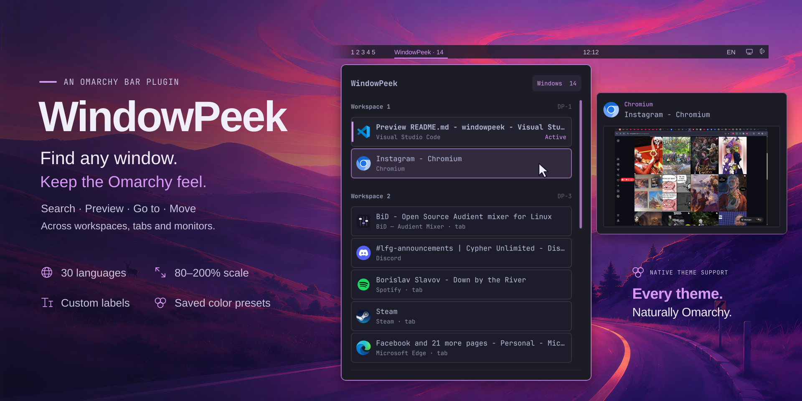

# Hover-panel artwork before Wallpaper

The previous 1920 × 960 preview, preserved before the Wallpaper illustration.
It shows real application windows and Hyprland group tabs, with Instagram in
Chromium and “Down by the River” in the Spotify row.



- [Self-contained SVG](preview.svg)
- [Hover list](preview-hover.png) and [window preview](preview-thumbnail.png)
- [Original rendering record](preview-render.json) and [checksums](sha256.json)
- [Original composition recipe](recipe-original.txt)

From the repository root, render a separate copy with:

```sh
python3 tools/make_preview.py \
  --source docs/artwork-history/2026-09-22-before-wallpaper/preview.svg \
  --output /tmp/windowpeek-before-wallpaper.png
```

The earlier artwork versions remain in their existing archive folders.
The wallpaper comes from Omarchy; its [MIT notice](../../../vendor/omarchy/LICENSE)
is retained. Composition and wording: Sarr. Application icons and preview content
belong to their respective owners.
